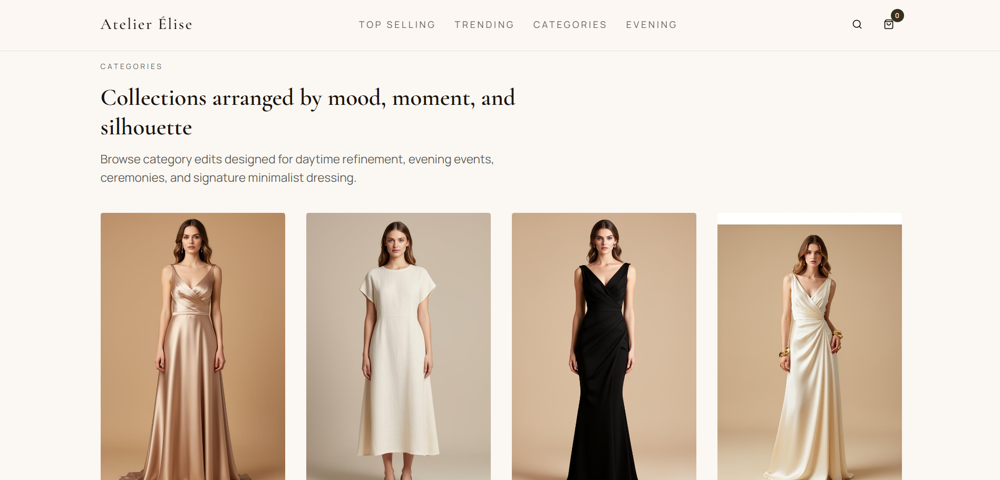

# Luxe Dress Boutique

A modern e-commerce storefront built with React, TypeScript, Vite, Tailwind CSS, and TanStack Router.

## Summary

This project is a boutique shopping website template with product categories, detail pages, responsive layout, and a polished UI shell. The app is structured using React components under `src/components`, route configuration under `src/routes` and `src/router.tsx`, and styling via Tailwind CSS.

## What was built

- Responsive product browsing experience
- Category and product detail pages
- Custom app shell layout with header, footer, and cart support
- Route-driven app architecture with TanStack Router
- Tailwind CSS styling and utility-based UI components

## Technologies used

- React 19
- TypeScript
- Vite
- Tailwind CSS
- TanStack Router
- Radix UI primitives
- React Hook Form
- Recharts

## How to run

1. Install dependencies:
   ```bash
   npm install
   ```
2. Start development server:
   ```bash
   npm run dev
   ```
3. Open the local URL shown in the terminal.

## Project structure

- `src/` — main source code
- `src/router.tsx` — router setup and app entry logic
- `src/routes/` — route definitions and page components
- `src/components/` — UI and layout components
- `src/styles.css` — main global styles

## Screenshots

- [homepage]

- [category page]

- [product details page]


## Notes

Add screenshot images later and replace the placeholder text above with actual image links or embedded Markdown image tags.
