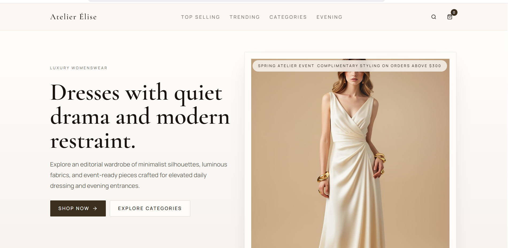
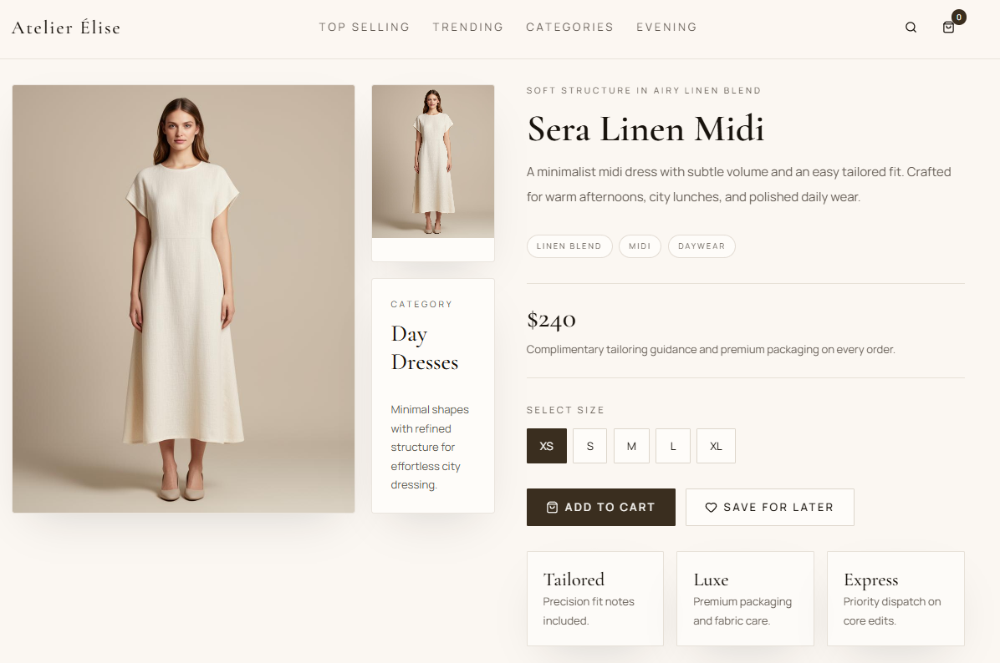

# Luxe Dress Boutique

A modern e-commerce storefront built with React, TypeScript, Vite, Tailwind CSS, and TanStack Router.

## Summary

This project is a boutique shopping website template with product categories, detail pages, responsive layout, and a polished UI shell. The app is now organized into separate folders for the frontend, backend, and dashboard. The frontend source lives under `frontend/src`, with routes under `frontend/src/routes` and router setup in `frontend/src/router.tsx`.

## What was built

- Responsive product browsing experience
- Category and product detail pages
- Custom app shell layout with header, footer, and cart support
- Route-driven app architecture with TanStack Router
- Tailwind CSS styling and utility-based UI components

## Technologies used

- React 19
- TypeScript
- Vite
- Tailwind CSS
- TanStack Router
- Radix UI primitives
- React Hook Form
- Recharts

## How to run

1. Install dependencies:
   ```bash
   npm install
   ```
2. Start development server:
   ```bash
   npm run dev
   ```
3. Open the local URL shown in the terminal.

## Project structure

- `frontend/` — frontend application files
- `frontend/src/` — main frontend source code
- `frontend/src/router.tsx` — router setup and app entry logic
- `frontend/src/routes/` — route definitions and page components
- `frontend/src/components/` — UI and layout components
- `backend/` — backend/API placeholder folder
- `dashboard/` — dashboard/admin UI placeholder folder

## Backend

The `backend/` folder is reserved for server-side logic, APIs, and database integrations. Currently a placeholder — add your API endpoints, authentication, and data models here when building the backend.

## Dashboard

The `dashboard/` folder is reserved for the admin interface. Currently a placeholder — add admin panels, analytics, and management tools here when building the dashboard.

## Screenshots

- [homepage]

- [category page]

- [product details page]

